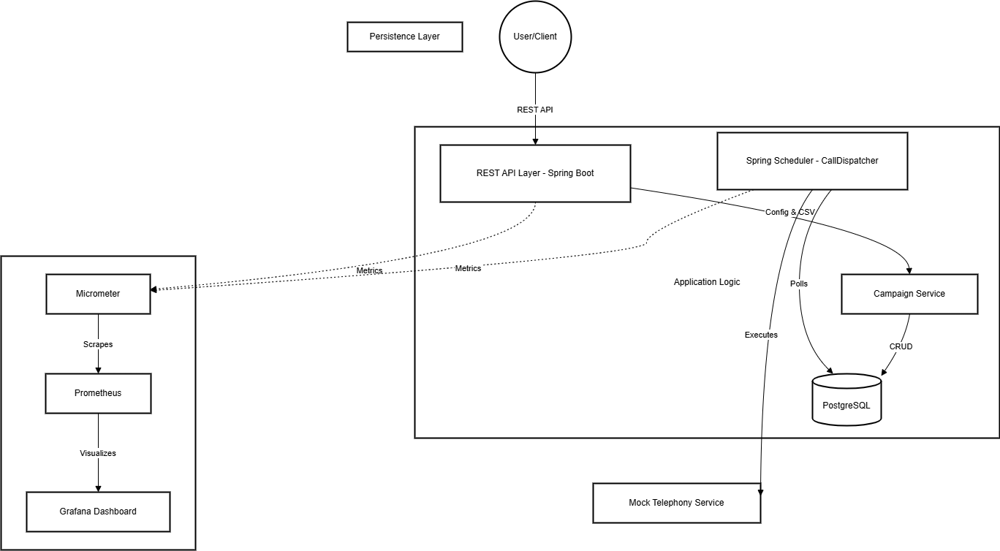
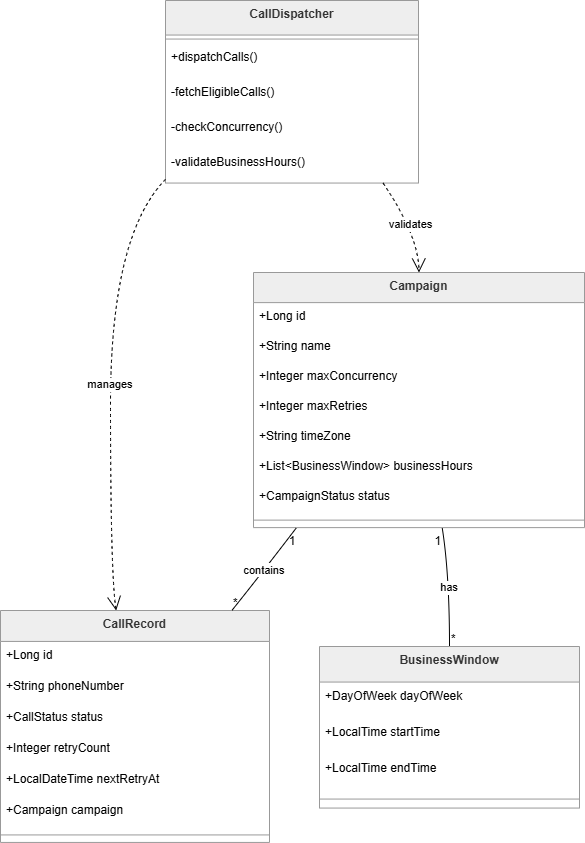
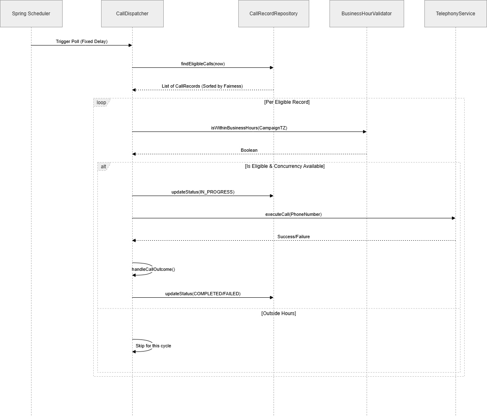

# Design Document: Outbound Voice Campaign Manager

This document outlines the architectural and design decisions for the Outbound Voice Campaign Manager, a system built for high-reliability scheduling, concurrency control, and observability in automated voice outreach.

---

## 1. High-Level Design (HLD)

The system follows a **Modular Monolith** architecture with a clear separation between the API-driven configuration layer and the background execution engine.

### Core Components
1.  **REST API Layer (Spring Boot):** Provides endpoints for campaign management, CSV data ingestion, and status monitoring.
2.  **Persistence Layer (PostgreSQL):** Stores campaign metadata, business windows, and the state of every individual call record.
3.  **Background Dispatcher (Spring Scheduler):** A pull-based worker that polls for eligible calls, enforces concurrency limits, and manages the lifecycle of a call attempt.
4.  **Observability Stack (Micrometer + Prometheus + Grafana):** Collects and visualizes operational metrics like success rates, thread health, and retry pressure.

---

## 2. Low-Level Design (LLD)

### Data Models & Entities
* **Campaign:** Root entity containing configuration (max retries, concurrency, timezone) and a collection of `BusinessWindow` objects stored as JSON.
* **CallRecord:** Represents an individual call attempt. Tracks `retryCount`, `lastAttemptAt`, and `nextRetryAt` for scheduling logic.
* **Enums:** `CallStatus` (PENDING, IN_PROGRESS, COMPLETED, FAILED) and `CampaignStatus`.

### Core Logic: The Call Dispatcher
The `CallDispatcher` is the "brain" of the system. It executes on a fixed-delay schedule and follows these steps:
1.  **Fetch Eligible Records:** Queries `CallRecord` table for records where `status = PENDING` and `nextRetryAt <= now`.
2.  **Prioritization (Fairness):** Uses the `COALESCE(nextRetryAt, createdAt)` SQL logic to ensure retries are prioritized alongside new calls in a chronological "fair" queue.
3.  **Per-Campaign Concurrency:** Before dispatching, it checks the active count of `IN_PROGRESS` calls for that specific campaign ID.
4.  **Business Hour Validation:** Converts system time to the campaign's `timezone` and checks against the defined `businessHours` windows.

---

## 3. Design Decisions & Trade-offs

### Pull-Based Polling vs. Event-Driven Messaging
* **Choice:** Database Polling.
* **Rationale:** For the current scope, polling ensures **strong consistency** and simplicity. It allows for easy "Fairness" implementation via SQL sorting.
* **Trade-off:** As the volume reaches millions of records, polling can become a DB bottleneck. We mitigate this currently through indexed queries on `(status, next_retry_at)`.

### CSV Bulk Ingestion vs. Individual API Calls
* **Choice:** Multipart CSV Upload.
* **Rationale:** Uploading thousands of numbers via individual API calls introduces network overhead and latency. CSV processing allows the system to handle "Number Groups" as a single administrative unit.
* **Trade-off:** Large CSVs can consume memory. The current implementation uses batch saving to optimize performance.

### Per-Campaign Concurrency vs. Global Rate Limiting
* **Choice:** Per-Campaign Concurrency.
* **Rationale:** Ensures that a single large campaign cannot "starve" smaller, potentially higher-priority campaigns.
* **Trade-off:** Requires multiple count queries to the DB per dispatch cycle.

---

## 4. Design Patterns Used

1.  **Repository Pattern:** Decouples the business logic from the data access layer (Spring Data JPA).
2.  **Strategy Pattern (Mock Telephony):** Encapsulates the telephony behavior (latency, success/failure) into a configurable mock service.
3.  **Global Exception Handling:** Uses `@ControllerAdvice` to provide a unified, professional API response structure for validation and resource errors.
4.  **Builder Pattern:** Utilized via Lombok for clean construction of DTOs and Entities.

---

## 5. Scalability & Future Improvements

### Horizontal Scaling
To scale horizontally across multiple application nodes:
* **Distributed Locking:** Integrate **ShedLock** or **Redis (Redisson)** to ensure only one instance of the scheduler runs at a time, or that multiple instances do not pick up the same `CallRecord`.

### Message Queue Integration (Kafka)
Replace DB polling with a **Kafka-based Consumer Group**:
* Campaign creation pushes numbers to a Kafka Topic.
* Workers consume numbers, check concurrency via a distributed counter (Redis), and perform the call. This transitions the system to a high-throughput, "Push-based" model.

### Batch Processing (Spring Batch)
For massive CSV files (e.g., 1M+ rows), the system can be evolved to use **Spring Batch** to handle streaming reads, chunked processing, and multi-threaded writing to the database to prevent memory saturation.

---

## 6. Security Considerations
* **Input Validation:** Strict JSR-303 validation on all DTOs to prevent SQL injection or invalid state transitions.
* **Rate Limiting:** Proposed integration of a bucket-filling algorithm (e.g., Resilience4j) to protect the API layer from DoS.